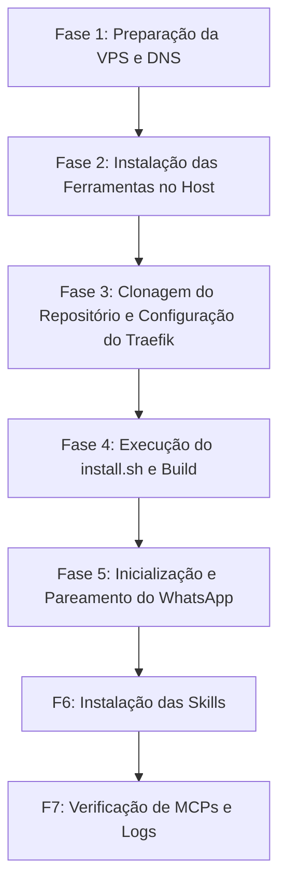

# 🗺️ GUIA DEFINITIVO — Instalação da Stack HermesClawGowa com Traefik e HTTPS

Este é o roteiro passo a passo definitivo para configurar a sua VPS de 8GB de RAM com um Swap de 12GB, instalar todo o ambiente de compiladores nativos, clonar o ecossistema **HermesClawGowa** e expor de forma segura os painéis web em HTTPS público nos domínios **open.vendoideias.com** e **hermes.vendoideias.com** usando o **Traefik**.

---

## 📋 Fases da Instalação



---

## 🌐 FASE 1: DNS & Swap de 12GB

### 1.1 Configuração de DNS
No painel do seu domínio (`vendoideias.com`), aponte os seguintes registros **Tipo A** para o IP público da sua VPS:

| Nome/Subdomínio | Tipo | Destino (IP da VPS) |
| :--- | :--- | :--- |
| `open.vendoideias.com` | A | `IP_DA_SUA_VPS` |
| `hermes.vendoideias.com` | A | `IP_DA_SUA_VPS` |

### 1.2 Configuração de Swap na VPS
Conecte-se na sua VPS via SSH e execute os comandos para criar a Swap de 12GB:
```bash
ssh root@IP_DA_SUA_VPS

# Cria, formata e ativa o swap
sudo fallocate -l 12G /swapfile
sudo chmod 600 /swapfile
sudo mkswap /swapfile
sudo swapon /swapfile

# Torna persistente no boot
echo '/swapfile swap swap defaults 0 0' | sudo tee -a /etc/fstab

# Ajusta swappiness para priorizar memória física
sudo sysctl vm.swappiness=10
echo 'vm.swappiness=10' | sudo tee -a /etc/sysctl.conf
```

---

## 💻 FASE 2: Preparação do Sistema e Ferramentas no Host

Garanta que a VPS tenha todos os ambientes de desenvolvimento prontos. Copie e cole este bloco de comandos de uma vez:

```bash
# Ajusta fuso horário
timedatectl set-timezone America/Sao_Paulo

# Atualiza sistema e utilitários
apt update && apt upgrade -y
apt install -y curl wget git nano htop jq unzip build-essential \
  gcc g++ make software-properties-common apt-transport-https \
  ca-certificates gnupg lsb-release ffmpeg \
  python3 python3-pip python3-venv python3-dev

# Instala Node.js LTS
curl -fsSL https://deb.nodesource.com/setup_lts.x | bash -
apt install -y nodejs

# Instala Go (mais recente)
GO_VERSION=$(curl -s https://go.dev/VERSION?m=text | head -1)
wget -q "https://go.dev/dl/${GO_VERSION}.linux-amd64.tar.gz" -O /tmp/go.tar.gz
rm -rf /usr/local/go && tar -C /usr/local -xzf /tmp/go.tar.gz && rm /tmp/go.tar.gz
echo 'export PATH=$PATH:/usr/local/go/bin:$HOME/go/bin' >> ~/.bashrc
export PATH=$PATH:/usr/local/go/bin:$HOME/go/bin

# Instala Docker Engine
curl -fsSL https://get.docker.com | sh
usermod -aG docker root

# Recarrega variáveis
source ~/.bashrc

# Validação das versões instaladas
echo "✅ Python: $(python3 --version)"
echo "✅ Node: $(node --version)"
echo "✅ Go: $(go version)"
echo "✅ Docker: $(docker --version)"
```

---

## 🐳 FASE 3: Clonagem do Projeto e Configuração do Traefik

Nesta fase, integraremos o Traefik para emitir automaticamente o SSL HTTPS e fazer o roteamento inteligente dos subdomínios para o container `openclaw-vibestack`.

### 3.1 Clonagem
```bash
cd /root
git clone https://github.com/vendoideias2/hermesclawgowa.git
cd hermesclawgowa
```

### 3.2 Edição do `docker-compose.yml`
Substitua ou edite as seções dos serviços `traefik` e `openclaw-vibestack` no arquivo `docker-compose.yml` para habilitar a resolução de rotas do Traefik.

> [!NOTE]
> O container `openclaw-vibestack` expõe múltiplos serviços em portas internas diferentes. Rotearemos `open.vendoideias.com` para a porta `18789` (Interface OpenClaw) e `hermes.vendoideias.com` para a porta `9119` (Hermes Dashboard).

Edite o arquivo (`nano docker-compose.yml`) alterando estes dois blocos para a seguinte estrutura:

```yaml
services:
  # --- PROXY REVERSO TRAEFIK com HTTPS ---
  traefik:
    image: traefik:v3.0
    container_name: hermesclawgowa-traefik-1
    restart: unless-stopped
    command:
      - "--api.insecure=false"
      - "--providers.docker=true"
      - "--providers.docker.exposedbydefault=false"
      - "--entrypoints.web.address=:80"
      - "--entrypoints.websecure.address=:443"
      # Redirecionamento automático HTTP -> HTTPS
      - "--entrypoints.web.http.redirections.entryPoint.to=websecure"
      - "--entrypoints.web.http.redirections.entryPoint.scheme=https"
      # Configuração Let's Encrypt
      - "--certificatesresolvers.myresolver.acme.httpchallenge=true"
      - "--certificatesresolvers.myresolver.acme.httpchallenge.entrypoint=web"
      - "--certificatesresolvers.myresolver.acme.email=contato@vendoideias.com"
      - "--certificatesresolvers.myresolver.acme.storage=/letsencrypt/acme.json"
    ports:
      - "80:80"
      - "443:443"
    volumes:
      - "./letsencrypt:/letsencrypt"
      - "/var/run/docker.sock:/var/run/docker.sock:ro"
    networks:
      - default

  # --- OPENCLAW E HERMES VIBESTACK ---
  openclaw-vibestack:
    image: hermesclawgowa-openclaw-vibestack:latest
    build:
      context: .
      dockerfile: Dockerfile
    container_name: hermesclawgowa-openclaw-vibestack-1
    restart: unless-stopped
    environment:
      - OLLAMA_BASE_URL=http://host.docker.internal:11434
      - DEFAULT_MODEL=phi4-mini
    extra_hosts:
      - "host.docker.internal:host-gateway"
    networks:
      - default
    labels:
      - "traefik.enable=true"
      # Roteamento OpenClaw UI (Porta 18789)
      - "traefik.http.routers.openclaw.rule=Host(`open.vendoideias.com`)"
      - "traefik.http.routers.openclaw.entrypoints=websecure"
      - "traefik.http.routers.openclaw.tls.certresolver=myresolver"
      - "traefik.http.routers.openclaw.service=openclaw-ui-service"
      - "traefik.http.services.openclaw-ui-service.loadbalancer.server.port=18789"
      
      # Roteamento Hermes Dashboard (Porta 9119)
      - "traefik.http.routers.hermesdash.rule=Host(`hermes.vendoideias.com`)"
      - "traefik.http.routers.hermesdash.entrypoints=websecure"
      - "traefik.http.routers.hermesdash.tls.certresolver=myresolver"
      - "traefik.http.routers.hermesdash.service=hermes-dash-service"
      - "traefik.http.services.hermes-dash-service.loadbalancer.server.port=9119"

# Cria a pasta que armazenará os certificados SSL
# (certifique-se de estar na pasta /root/hermesclawgowa)
```
Crie a pasta de certificados antes de iniciar:
```bash
mkdir -p letsencrypt
```

---

## 🚀 FASE 4: Execução do install.sh e Build do Docker

Agora rodaremos o script instalador oficial do repositório para gerar o `.env` interativo, baixar o Ollama local e compilar o container principal.

```bash
# Torna o script executável
chmod +x install.sh

# Executa o instalador interativo
./install.sh
```

### 💬 Respostas recomendadas para o instalador:
1. **Domínio:** `vendoideias.com`
2. **Modelo Ollama para baixar:** `phi4-mini` (será baixado no boot do Ollama)
3. **MCP de Meta Ads:** Responda `s` se tiver o token, caso contrário responda `N`
4. **Media Editor (B2):** Responda `s` se utilizar armazenamento Backblaze, caso contrário responda `N`
5. **GOWA Basic Auth:** Defina o usuário e senha desejados (ex: `admin:senha_forte_123`)
6. **Número de WhatsApp:** Digite o seu número no formato internacional (ex: `5517999999999`)
7. **Configurar Proxy Estático:** Responda `n`

*O instalador irá buildar a imagem do container `openclaw-vibestack` (este processo demora de 5 a 10 minutos).*

---

## 🚀 FASE 5: Inicialização e Pareamento do WhatsApp

Após a finalização da build, iniciaremos os containers e faremos as configurações rápidas iniciais dos modelos locais.

### 5.1 Subir a Stack
```bash
docker compose up -d
```

### 5.2 Configuração Inicial do OpenClaw e Modelo Hermes
```bash
# 1. Configura as definições base do OpenClaw
docker compose exec openclaw-vibestack openclaw configure

# 2. Reinicia o container para aplicar as mudanças
docker compose up -d --force-recreate openclaw-vibestack

# 3. Define o modelo padrão de raciocínio (Selecione: Ollama -> phi4-mini ou gemma4:e2b)
docker compose exec openclaw-vibestack hermes model
```

### 5.3 Pareamento do WhatsApp (GOWA)
Para acessar o painel do GOWA Manager que roda na porta `3000` (esta porta não está exposta sob o domínio público por motivos de segurança), crie um túnel SSH no seu computador local:

```bash
# Execute este comando no terminal do seu computador de casa:
ssh -N -L 3000:127.0.0.1:3000 root@IP_DA_SUA_VPS
```

Agora, abra seu navegador local em: **`http://localhost:3000`**
1. Faça login usando os dados do `GOWA Basic Auth` definidos na Fase 4.
2. Aponte a câmera do seu celular e escaneie o **QR Code** para parear seu número de WhatsApp.

---

## 🚀 FASE 6: Instalação das Skills (Catálogo de 5300+)

Com o sistema rodando, criaremos um script interativo para instalar as skills de produtividade recomendadas para o OpenClaw e Hermes.

### 6.1 Criar o instalador de skills na VPS
Crie o arquivo do instalador:
```bash
nano /root/install-skills.sh
```

Cole o conteúdo abaixo dentro dele, salve e feche o arquivo:
```bash
#!/bin/bash
set -euo pipefail
SKILLS_DIR="/root/.openclaw/skills"
HERMES_SKILLS_DIR="/root/.hermes/skills"
mkdir -p "$SKILLS_DIR" "$HERMES_SKILLS_DIR"

GREEN='\033[0;32m'
BLUE='\033[0;34m'
YELLOW='\033[1;33m'
RED='\033[0;31m'
NC='\033[0m'

install_skill() {
    local skill_name="$1"
    local skill_desc="$2"
    echo -e "${YELLOW}📦 Instalando: ${skill_name}${NC}"
    if hermes skills install "$skill_name" 2>/dev/null; then
        echo -e "${GREEN}   ✅ Instalado via registry${NC}"
        return 0
    fi
    if hermes skills tap add "$skill_name" 2>/dev/null; then
        echo -e "${GREEN}   ✅ Adicionado via tap${NC}"
        return 0
    fi
    SKILL_REPO_NAME=$(basename "$skill_name")
    if git clone "https://github.com/${skill_name}.git" "$HERMES_SKILLS_DIR/$SKILL_REPO_NAME" 2>/dev/null; then
        echo -e "${GREEN}   ✅ Clonado manualmente${NC}"
        if [ -f "$HERMES_SKILLS_DIR/$SKILL_REPO_NAME/requirements.txt" ]; then
            pip3 install -r "$HERMES_SKILLS_DIR/$SKILL_REPO_NAME/requirements.txt" --quiet --break-system-packages || true
        fi
        return 0
    fi
    echo -e "${RED}   ❌ Não foi possível instalar${NC}"
    return 1
}

echo -e "${YELLOW}Deseja instalar as skills recomendadas de curadoria? (s/n):${NC}"
read -r install_now
if [[ "$install_now" =~ ^[Ss]$ ]]; then
    install_skill "codesstar/hermes-skill-atlas" "Atlas Skill (Deploy e gerenciamento)"
    install_skill "prompt-security/clawsec" "Security Suite (Proteção de execução)"
    install_skill "ChrisLamDev/hermes-core-skills" "Core Skills (Desenvolvimento e Debugging)"
fi
```

### 6.2 Executar o script
```bash
chmod +x /root/install-skills.sh
/root/install-skills.sh
```

---

## 🚀 FASE 7: Verificação e Testes Finais

Após concluir os passos anteriores, você já pode acessar as interfaces públicas:

*   **OpenClaw Web UI:** `https://open.vendoideias.com`
*   **Hermes Dashboard:** `https://hermes.vendoideias.com`

*(O certificado HTTPS do Let's Encrypt será configurado e ativado de forma 100% transparente pelo Traefik na primeira vez que você abrir os sites).*

### 7.1 Testar Comunicação no Terminal da VPS
```bash
# 1. Verifica se os MCPs estão ativos
docker compose exec openclaw-vibestack openclaw mcp list

# 2. Testa o status de conexão da API do WhatsApp GOWA
docker compose exec openclaw-vibestack curl -s http://gowa:3000/app/status
```

### 7.2 Comandos Úteis de Monitoramento
```bash
# Acompanhar logs do Traefik (verificação de SSL)
docker compose logs -f traefik

# Logs do container integrado do OpenClaw/Hermes
docker compose logs -f openclaw-vibestack

# Reiniciar toda a stack
docker compose restart
```
